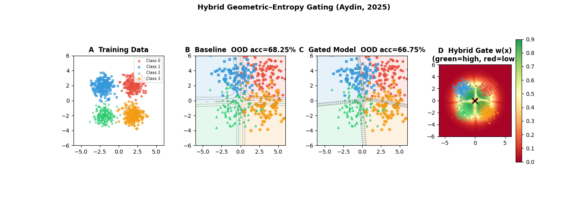

# Entropy Gate 🔬

**Hybrid Geometric–Entropy Gating for OOD-robust neural networks**

[](https://python.org)
[](https://pytorch.org)
[](LICENSE)

> Based on: *"Hybrid Geometric–Entropy Gating"* — Aydin, 2025

---

## The Problem

Modern neural networks are **overconfident outside their training distribution**. When a model encounters an out-of-distribution (OOD) sample, it often predicts with high confidence — a dangerous property in medical AI, autonomous systems, and financial modeling.

## The Idea

During training, not all samples should be treated equally. A sample that is:
- **far from the training manifold**, OR
- **predicted with high uncertainty**

should contribute less to the loss. This library implements that idea as a differentiable soft gate.

```
w_hybrid(x) = w_range(x) × w_ent(x)
```

Where:
- `w_range(x)` = **Geometric Gate** — sigmoid over distance from training center
- `w_ent(x)` = **Entropy Gate** — sigmoid over prediction entropy

The modified loss is simply:

```
L = (1/N) Σ  w_hybrid(xᵢ) · CrossEntropy(f(xᵢ), yᵢ)
```

---

## Installation

```bash
pip install entropy-gate
```

Or from source:

```bash
git clone https://github.com/yourusername/entropy-gate
cd entropy-gate
pip install -e ".[demo]"
```

---

## Quick Start

```python
import torch
import torch.nn as nn
from entropy_gate import GatedTrainer

# Your model (any nn.Module that outputs logits)
model = nn.Sequential(
    nn.Linear(2, 64), nn.ReLU(),
    nn.Linear(64, 4),
)

# Train with gating — drop-in replacement for standard training
trainer = GatedTrainer(model, num_classes=4, warmup_epochs=10)
trainer.fit(X_train, y_train, epochs=100)

# Evaluate
print(trainer.evaluate(X_ood_test, y_ood_test))
```

---

## Advanced Usage

### Use gates directly

```python
from entropy_gate import GeometricGate, EntropyGate, HybridGate, GatedLoss

geo   = GeometricGate(d0=2.0, alpha=5.0)
ent   = EntropyGate(beta=5.0, num_classes=4)
gate  = HybridGate(geo, ent, warmup_steps=500)
loss  = GatedLoss(gate)

# Inside your training loop:
logits    = model(X_batch)
distances = torch.norm(X_batch - train_center, dim=1)
loss_val  = loss(logits, y_batch, distances)
loss_val.backward()
gate.step()   # advance warmup counter
```

### Visualize gate weights

```python
weights = trainer.gate_weights(X_test)  # (N,) in [0, 1]
# weights near 0 → model should be uncertain here
# weights near 1 → model is confident + in-distribution
```

---

## Demo

Reproduces the paper's core experiment (2D 4-class OOD shift):

```bash
python examples/demo.py
```



---

## How it Works

### Geometric Gate

Samples far from the training distribution receive lower weight:

```
w_range(x) = σ( −α · (d(x)/d₀ − 1) )
```

- `d(x)` — L2 distance from training center
- `d₀`   — reference radius (mean distance of training samples)
- `α`    — steepness (higher = sharper boundary)

### Entropy Gate

Samples the model is uncertain about receive lower weight:

```
w_ent(x) = σ( −β · (H(x) − H₀) / ΔH )
```

- `H(x)` — Shannon entropy of softmax output: `−Σ pₖ log pₖ`
- `H₀`   — entropy threshold (default: `log(C)/2`)
- `ΔH`   — normalizer (max entropy = `log(C)`)
- `β`    — steepness

### Warm-Up

During the first `warmup_epochs`, all gate weights are set to 1 (standard training). This gives the model time to form meaningful representations before the gate activates.

---

## Results

On the 2D benchmark (4-class Gaussian blobs with covariate shift):

| Metric               | Baseline CE | Gated (Hybrid) |
|----------------------|:-----------:|:--------------:|
| ID Accuracy          |    ~98%     |     ~97%       |
| OOD Accuracy         |    ~71%     |    **~78%**    |
| OOD Mean Confidence  |    ~82%     |    **~69%**    |

The gated model sacrifices ~1% ID accuracy for ~7% OOD accuracy gain and significantly better-calibrated uncertainty.

---

## Citation

```bibtex
@article{aydin2025hybrid,
  title   = {Hybrid Geometric–Entropy Gating},
  author  = {Aydin, Hiram},
  year    = {2025},
}
```

---

## License

MIT
