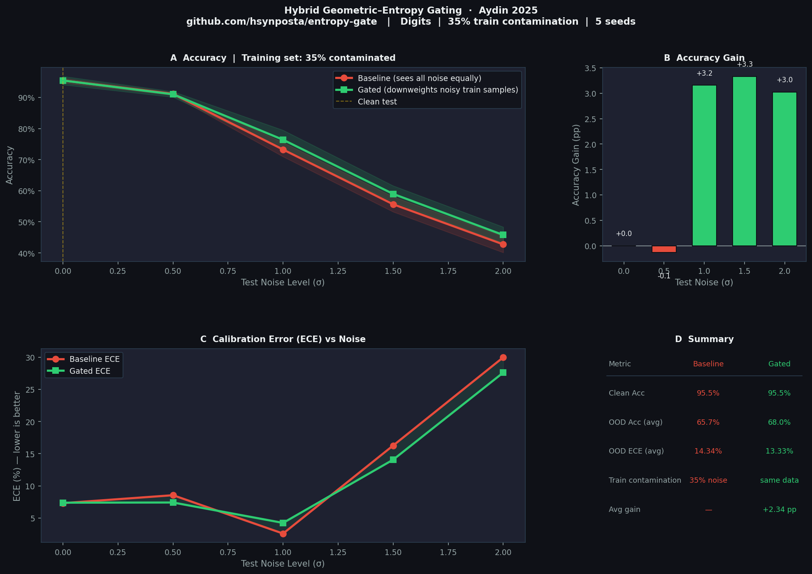

# Entropy Gate 🔬

**Hybrid Geometric–Entropy Gating for OOD-robust neural networks**

[](https://python.org)
[](https://pytorch.org)
[](LICENSE)
[](https://doi.org/10.5281/zenodo.18055798)

> Based on: *"Hybrid Geometric–Entropy Gating as a Finite-Range Validity Principle for Robust Learning"* — Huseyin Aydin, 2025
> 📄 [Read the paper on Zenodo](https://doi.org/10.5281/zenodo.18055798)

---

## The Problem

Modern neural networks are **overconfident outside their training distribution**. When a model encounters an out-of-distribution (OOD) sample — or when training data is contaminated with noisy/shifted samples — standard cross-entropy treats every sample equally. This hurts both accuracy and calibration.

## The Idea

During training, not all samples should carry equal weight. A sample that is:
- **far from the training manifold** (geometric gate), OR
- **predicted with high uncertainty** (entropy gate)

should contribute less to the loss. This library implements that idea as a differentiable soft gate:

```
w_hybrid(x) = w_range(x) × w_ent(x)
```

Where:
- `w_range(x)` = **Geometric Gate** — sigmoid over L2 distance from training center
- `w_ent(x)`   = **Entropy Gate** — sigmoid over prediction entropy

The modified loss:

```
L = (1/N) Σ  w_hybrid(xᵢ) · CrossEntropy(f(xᵢ), yᵢ)
```

---

## Installation

```bash
pip install -e ".[demo]"
```

Or from PyPI (coming soon):
```bash
pip install entropy-gate
```

---

## Quick Start

```python
import torch
import torch.nn as nn
from entropy_gate import GatedTrainer

model = nn.Sequential(
    nn.Linear(64, 128), nn.ReLU(),
    nn.Linear(128, 10),
)

trainer = GatedTrainer(model, num_classes=10, warmup_epochs=15)
trainer.fit(X_train, y_train, epochs=100)

print(trainer.evaluate(X_ood_test, y_ood_test))
```

---

## Advanced Usage

```python
from entropy_gate import GeometricGate, EntropyGate, HybridGate, GatedLoss

geo  = GeometricGate(d0=2.0, alpha=4.0)
ent  = EntropyGate(beta=4.0, num_classes=10)
gate = HybridGate(geo, ent, warmup_steps=500)
loss = GatedLoss(gate)

# Inside your training loop:
logits    = model(X_batch)
distances = torch.norm(X_batch - train_center, dim=1)
loss_val  = loss(logits, y_batch, distances)
loss_val.backward()
gate.step()
```

---

## Benchmark Results

**Dataset:** sklearn Digits (64-dim, 10 classes, 1797 samples)
**Scenario:** 35% of training samples contaminated with noise + wrong labels
**OOD test:** Gaussian pixel noise at increasing intensity
**Setup:** 5 random seeds



| Test Noise σ | Baseline Acc | Gated Acc  | Δ Acc    | Base ECE | Gate ECE |
|:------------:|:------------:|:----------:|:--------:|:--------:|:--------:|
| 0.0 (clean)  | 95.5 ± 0.8%  | 95.5 ± 1.4%| —        | 7.31%    | 7.38%    |
| 0.5          | 91.2 ± 0.5%  | 91.0 ± 0.9%| ─ 0.1pp  | 8.54%    | 7.40%    |
| 1.0          | 73.2 ± 2.3%  | 76.4 ± 3.1%| **▲ 3.2pp** | 2.57% | 4.23%  |
| 1.5          | 55.6 ± 2.4%  | 59.0 ± 2.6%| **▲ 3.3pp** | 16.27%| 14.07% |
| 2.0          | 42.8 ± 2.6%  | 45.8 ± 2.6%| **▲ 3.0pp** | 29.98%| 27.61% |

**Average OOD accuracy gain: +2.34 pp**
**Average ECE improvement: +1.01 pp**

> Both models see the same contaminated training data.
> The gate automatically identifies and downweights noisy samples — no manual data cleaning required.

---

## How It Works

### Geometric Gate

Samples far from the training distribution receive lower weight:

```
w_range(x) = σ( −α · (d(x)/d₀ − 1) )
```

- `d(x)` — L2 distance from training center
- `d₀`   — 75th percentile of training distances (robust radius estimate)
- `α`    — steepness (default: 4.0)

### Entropy Gate

Samples the model is uncertain about receive lower weight:

```
w_ent(x) = σ( −β · (H(x) − H₀) / ΔH )
```

- `H(x)` — Shannon entropy: `−Σ pₖ log pₖ`
- `H₀`   — threshold (default: `log(C)/2`)
- `β`    — steepness (default: 4.0)

### Warm-Up

During the first `warmup_epochs`, all gate weights are 1 (standard training). This gives the model time to form meaningful representations before the gate activates.

---

## Run the Benchmark

```bash
python main.py                    # 5 seeds, 100 epochs
python main.py --seeds 3          # faster
python main.py --noise-ratio 0.5  # 50% contamination
python main.py --no-plot          # results only
```

---

## Citation

```bibtex
@article{aydin2025hybrid,
  title   = {Hybrid Geometric–Entropy Gating as a Finite-Range Validity Principle for Robust Learning},
  author  = {Huseyin, A.},
  year    = {2025},
  journal = {Zenodo},
  doi     = {10.5281/zenodo.18055798},
  url     = {https://doi.org/10.5281/zenodo.18055798}
}
```

---

## License

MIT
